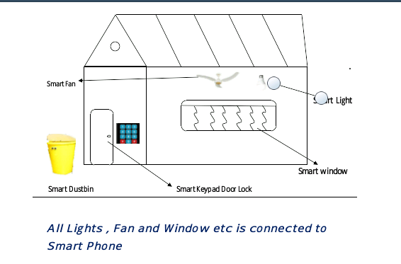

# Home-Automation
<html>
<head>
<meta name="description" content="xyz">
</head>
<body>
    <header>
      <nav class="navigation">
	    <ul class="nav-ul">
			<li><a href="home.html"> Home</a> </li>
		    <li><a href="component.html"> Description of Components</a> </li>
		    <li><a href="Circuit.html"> Circuit Diagram</a> </li>
		    <li><a href="about.html"> About</a> </li>
		</ul>
     </nav>
   </header>
	<main>
	<section id="free">
		<h1 id=hh1>HOME AUTOMATION</h1> 

		<marquee id="mr">IoT(Project)</marquee>
		

		<h1 id=hh2>Introduction</h1>
		
Introduction

Home automation systems are advancement to the mechanization processes wherein human efforts are needed with the machinery equipments to operate various loads in homes. 

Home automation system makes the operations of various home appliances more convenient and saves energy. With the energy saving concept,
 home automation or building automation makes life very simple nowadays. It involves automatic controlling of all electrical or electronic
 devices in homes or even remotely through wireless communication. Centralized control of lighting equipments, air conditioning and heating, 
 audio/video systems, security systems, kitchen appliances and all other equipments used in home systems is possible with this system.

<b id=b1>Machine, sensors & components—</b>

<h6>
<ul>
<li>Fan & electronic machine and components</li>
<li>Arduino</li>
<li>ESP8266 Node MCU</li>
<li>Relay Module</li>
<li>Keypad Door Lock</li>
<li>Dustbin</li>
<li>Bulb</li>
<li>Jumping Wires</li>
<li>Ultrasonic Sensor</li>
<li>Servo Motor</li>
<li>Stepper Motor etc.</li>
</ul></h6>

		
</body>
</html>
